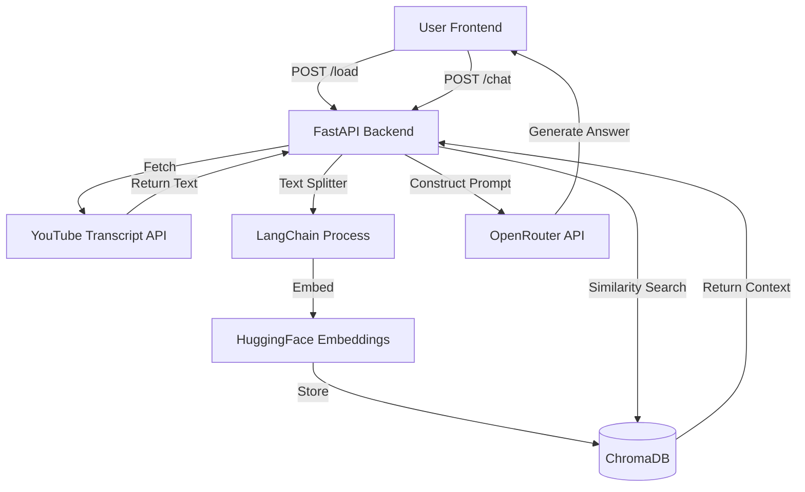

<h1 align="center">📺 YouTube RAG Chatbot</h1>

<p align="center">
  <b>Transform long YouTube videos into instantly searchable, interactive conversations.</b>
</p>

<p align="center">
  
  
  
  
  
</p>

<br/>

---

## 📸 Demo & Screenshots

> 📸 Screenshot coming soon — run locally to see the app in action

---

## 📑 Table of Contents

- [📸 Demo & Screenshots](#-demo--screenshots)
- [📖 About The Project](#-about-the-project)
- [✨ Features](#-features)
- [🏗️ Architecture & Workflow](#️-architecture--workflow)
- [🚀 Getting Started](#-getting-started)
- [🔌 API Reference](#-api-reference)
- [📁 Project Structure](#-project-structure)
- [🗺️ Roadmap](#️-roadmap)
- [🤝 Contributing](#-contributing)
- [📄 License](#-license)
- [✍️ Author & Acknowledgements](#️-author--acknowledgements)

---

## 📖 About The Project

The **YouTube RAG Chatbot** is a powerful full-stack web application designed to save time by letting users interactively chat with YouTube videos. Instead of scrubbing through a 2-hour tutorial or lecture to find a specific answer, you simply provide the URL, and the app instantly extracts the transcript, embeds the knowledge, and allows you to ask questions.

It solves the problem of information overload in long-form video content by utilizing **RAG (Retrieval-Augmented Generation)**. By combining the speed of local vector databases with the intelligence of modern Large Language Models (LLMs), it guarantees that the answers are directly sourced from the video itself.

### Built With

<p align="center">
  
  
  
  
  
</p>

---

## ✨ Features

- 🔗 **Automatic Extraction:** Instantly pull high-quality captions and transcripts from any public YouTube URL.
- 🧮 **Local Vector Storage:** Leverages ChromaDB locally to slice and index text chunks for lightning-fast retrieval.
- 🧠 **Context-Aware AI:** Uses advanced LLMs via OpenRouter to accurately answer questions based *only* on the video content.
- 🧹 **Seamless State Management:** Easily reset the database and swap between different videos with a single click.
- 🎨 **Sleek UI:** A modern, minimalistic HTML/JS frontend that interacts cleanly with the backend APIs.

---

## 🏗️ Architecture & Workflow

### A) Architecture Diagram

```text
[Frontend HTML/JS] ──► [FastAPI Backend] ──► [ChromaDB Vector Store]
       │                       ▲                        │
       ▼                       │                        ▼
[YouTube Transcript]   [OpenRouter LLM]  ◄───  [HuggingFace Embeddings]
```

### B) Step-by-Step Workflow

1. 🔗 User inputs a YouTube URL in the frontend interface.
2. 📡 Frontend sends a POST request to the `/load` endpoint.
3. 📜 Backend fetches the video transcript via the YouTube Transcript API.
4. ✂️ Transcript is split into smaller, manageable chunks using LangChain.
5. 🧮 Chunks are converted into vector embeddings via local HuggingFace models.
6. 💾 Vectors are saved persistently into the local ChromaDB storage.
7. ❓ User submits a question via the chat interface.
8. 🔍 Backend performs a similarity search on ChromaDB to find relevant video excerpts.
9. 🧠 The extracted context is injected into a prompt and sent to the OpenRouter LLM.
10. 💬 The LLM generates the final answer and returns it to the user's screen.

### C) Logic Flowchart



---

## 🚀 Getting Started

### Prerequisites

- **Python:** Version 3.9+ installed
- **Git:** Installed on your system
- **OpenRouter API Key:** A free or paid key from [OpenRouter](https://openrouter.ai/)
- **C++ Build Tools:** Required on Windows for compiling vector/embedding libraries.

### Installation

**1. Clone the repository**
```bash
git clone https://github.com/Anangivignesh/RAG-bot-for-Youtube-Summarization.git
cd RAG-bot-for-Youtube-Summarization/yt-chat
```

**2. Create a virtual environment**
```bash
python -m venv venv
# On Windows:
.\venv\Scripts\activate
# On macOS/Linux:
source venv/bin/activate
```

**3. Install dependencies**
```bash
pip install -r requirements.txt
# Alternatively: pip install fastapi uvicorn langchain langchain-chroma langchain-huggingface youtube-transcript-api python-dotenv requests
```

**4. Set up environment variables**
Create a `.env` file in the root folder and add your API key.
```bash
echo "OPENROUTER_API_KEY=your_key_here" > .env
```

**5. Start the server**
```bash
uvicorn main:app --reload --host 0.0.0.0 --port 8000
```
Open your browser and navigate to `http://localhost:8000`.

### Environment Variables

| Variable | Description | Example Value | Required |
|----------|-------------|---------------|----------|
| `OPENROUTER_API_KEY` | Your private key for accessing OpenRouter LLMs. | `sk-or-v1-abcdef123...` | **Yes** |

---

## 🔌 API Reference

| Method | Endpoint | Description | Request Body | Response |
|--------|----------|-------------|--------------|----------|
| `GET` | `/` | Serves the HTML frontend interface. | None | `index.html` file |
| `POST` | `/load` | Fetches transcript, creates vectors, and stores them in ChromaDB. | `{"url": "https://youtu.be/..."}` | `{"video_id": "...", "chunks_stored": 25}` |
| `POST` | `/chat` | Performs a RAG similarity search and generates an LLM response. | `{"question": "What is discussed?"}`| `{"answer": "...", "chunks_used": 4}` |
| `GET` | `/status` | Returns the current loaded status and video metadata. | None | `{"loaded": true, "video_id": "..."}` |
| `DELETE`| `/reset` | Drops the local database and clears the current video session. | None | `{"message": "Cleared."}` |

**Example request to `/chat`:**
```bash
curl -X POST http://localhost:8000/chat \
  -H "Content-Type: application/json" \
  -d '{"question": "Summarize the introduction."}'
```

---

## 📁 Project Structure

```text
yt-chat/
├── main.py           # FastAPI application & API endpoints
├── index.html        # Frontend HTML/JS entry point 
├── .env              # Environment variables (not committed)
├── .gitignore        # Git ignore rules
├── db/               # Local ChromaDB vector storage (generated)
└── venv/             # Python virtual environment (generated)
```

---

## 🗺️ Roadmap

- [x] Integrate YouTube Transcript Extraction API
- [x] Configure Local Vector Storage with ChromaDB
- [x] Connect LLM Generation via OpenRouter
- [ ] Add support for local LLMs (Ollama)
- [ ] Allow multiple videos to be indexed at once
- [ ] Implement proper user authentication
- [ ] Add conversation memory to the chat interface

---

## 🤝 Contributing

Contributions are what make the open source community such an amazing place to learn, inspire, and create. Any contributions you make are **greatly appreciated**.

```bash
# 1. Fork the Project
# 2. Create your Feature Branch
git checkout -b feature/AmazingFeature

# 3. Commit your Changes
git commit -m 'Add some AmazingFeature'

# 4. Push to the Branch
git push origin feature/AmazingFeature

# 5. Open a Pull Request
```

---

## 📄 License

<p align="center">
  
</p>

Distributed under the MIT License. Feel free to use, modify, and distribute as you see fit.

---

## ✍️ Author & Acknowledgements

<p align="center">
  <a href="https://github.com/Anangivignesh">
    
  </a>
</p>

**Acknowledgements:**
- [FastAPI Framework](https://fastapi.tiangolo.com/)
- [LangChain](https://www.langchain.com/)
- [ChromaDB](https://www.trychroma.com/)
- [OpenRouter](https://openrouter.ai/)
- [YouTube Transcript API](https://github.com/jdepoix/youtube-transcript-api)
